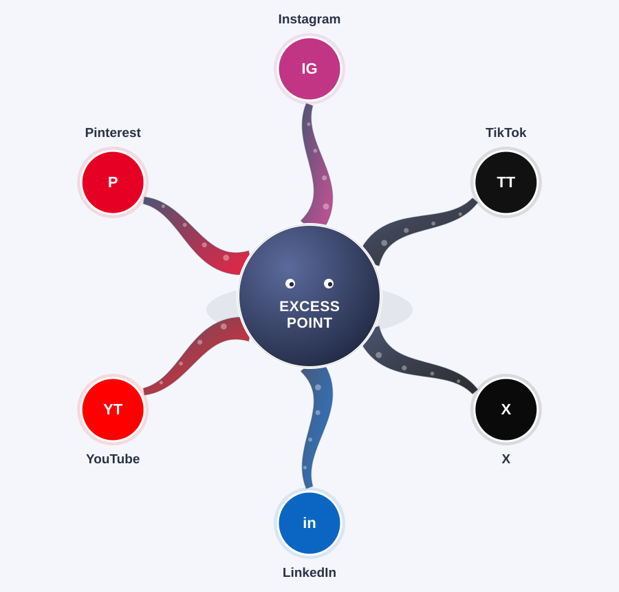

# Excess Point

A UK insurance comparison and buying-guide site, built as a pure affiliate /
content property (not a broker, not an introducer — see
[`docs/COMPLIANCE.md`](docs/COMPLIANCE.md) for why that distinction matters
and what it means for what you can post). Designed to be the link every
social post points back to.

"Excess Point" is a placeholder brand name — rename it wherever it appears
before you launch.



The site is the hub; `scripts/social/` turns each guide into a first-draft
post for all six spokes above. See
[`docs/SOCIAL_DISTRIBUTION.md`](docs/SOCIAL_DISTRIBUTION.md) for the
workflow and — importantly — where each platform legally requires the
affiliate disclosure to sit.

## Get it running

```bash
npm install
npm run dev       # http://localhost:5173
```

```bash
npm run build      # outputs a static site to /build
npm run preview     # preview the production build locally
```

The site is fully static (SvelteKit + `adapter-static`) — no backend, no
database. It deploys to Netlify, Vercel, Cloudflare Pages, or any static
host by pointing it at the `build/` folder after `npm run build`.

## File structure

```
excess-point/
├── content/                      ← edit this, not src/, for day-to-day content
│   ├── categories/                 5 files: the comparison-page content
│   │   ├── car.json                 (glossary, feature table, checklist)
│   │   ├── home.json
│   │   ├── pet.json
│   │   ├── life.json
│   │   └── travel.json
│   ├── posts/                     one JSON file per guide/social-source article
│   │   └── third-party-vs-comprehensive-car-insurance.json   (example)
│   └── affiliate-links.json       your actual affiliate URLs, once approved
│
├── src/
│   ├── app.html                   page shell
│   ├── lib/
│   │   ├── components/            Nav, Hero, CategorySection, GlossaryChip,
│   │   │                          ComparisonTable, Checklist, AffiliateCTA,
│   │   │                          Disclosure, Footer
│   │   ├── data/                  categories.js / affiliateLinks.js
│   │   │                          (load the JSON in /content — edit content,
│   │   │                          not these files)
│   │   └── styles/tokens.css      the whole design system (colours, type,
│   │                              light/dark) lives here
│   └── routes/
│       ├── +layout.svelte         Nav + Footer wrapper
│       ├── +page.svelte           homepage — hero + all 5 categories
│       ├── disclosure/+page.svelte  standalone page for a social bio link
│       └── blog/                  guides list + [slug] detail pages,
│                                  generated from content/posts/*.json
│
├── docs/
│   ├── COMPLIANCE.md              CAP Code + FCA notes — read before posting
│   ├── CONTENT_CALENDAR.md        template for planning weeks of content
│   ├── SOCIAL_DISTRIBUTION.md     the hub → six-platform plan, and the
│   │                              disclosure placement rules per platform
│   └── assets/social-reach-plan.svg
│
├── scripts/
│   ├── new-post-template.md       fill-in template for a new guide + caption
│   └── social/                    turns one guide into a draft per platform
│       ├── platforms.json           IG/TikTok/X/LinkedIn/YouTube/Pinterest specs
│       ├── generate.js              node scripts/social/generate.js <slug>
│       └── README.md
│
├── content/social-drafts/<slug>/  generated output of the script above
│                                  (one .md per platform, edited by hand)
│
├── static/                        favicon, robots.txt
└── .env.example                   copy to .env for analytics/publisher IDs
```

## The three things you'll actually touch week to week

1. **`content/affiliate-links.json`** — paste in real URLs once a program
   approves you. Until then, each category shows a clearly labelled
   placeholder instead of a dead or fake link.
2. **`content/posts/*.json`** — one file per guide. Use
   `scripts/new-post-template.md` to draft a new one; the social caption
   lives in the same file as the article so they never drift apart.
3. **`docs/COMPLIANCE.md`**'s per-program table — tick off what each
   affiliate program actually allows (PPC, paid social, email) before you
   post or spend anything there. This is the part most people skip and
   regret.
4. **`node scripts/social/generate.js <slug>`** — once a guide is written,
   this drafts the Instagram/TikTok/X/LinkedIn/YouTube/Pinterest versions
   for you to edit down, each with the right disclosure already in place.

## Pushing this to GitHub

The repo is already initialised locally with a first commit. To put it on
GitHub:

```bash
gh repo create excess-point --private --source=. --remote=origin --push
```

(or, without the `gh` CLI: create an empty repo on github.com, then
`git remote add origin <your-repo-url>` and `git push -u origin main`.)

It's set up **private** by default — this is a monetised affiliate site
with your commercial content in it, not something to open-source. There's
no LICENSE file for the same reason; if you ever do want to make part of
it public/reusable, add one deliberately rather than by default.

A GitHub Actions workflow (`.github/workflows/ci.yml`) runs `npm run build`
and validates every content JSON file on every push and pull request — it's
the check this sandbox couldn't run locally when the site was first
scaffolded, so it's worth watching that it goes green after your first push.

### Deploying

Any static host works off the `build/` folder that `npm run build` produces.
Netlify and Vercel can both build straight from the GitHub repo (build
command `npm run build`, publish directory `build`) without any extra
config — connect the repo in either dashboard and it picks the settings up
from `package.json`.

## About "automation"

The site itself is static content, not something that writes itself.
What *can* be automated is the drafting step — a scheduled job that
generates a new `content/posts/*.json` draft on a cadence, for you to
review and edit before it goes live. Given affiliate/financial content
carries real compliance requirements (CAP Code disclosure, accuracy), fully
unattended auto-publish isn't something to set up here — draft-then-review
is. Ask your Claude session to set that scheduled task up if you want it.
